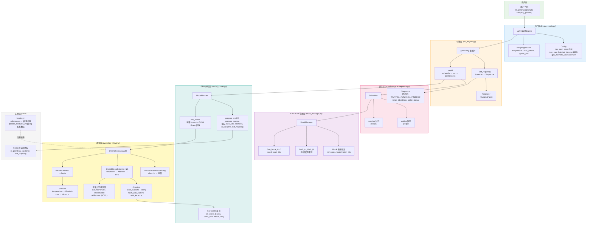
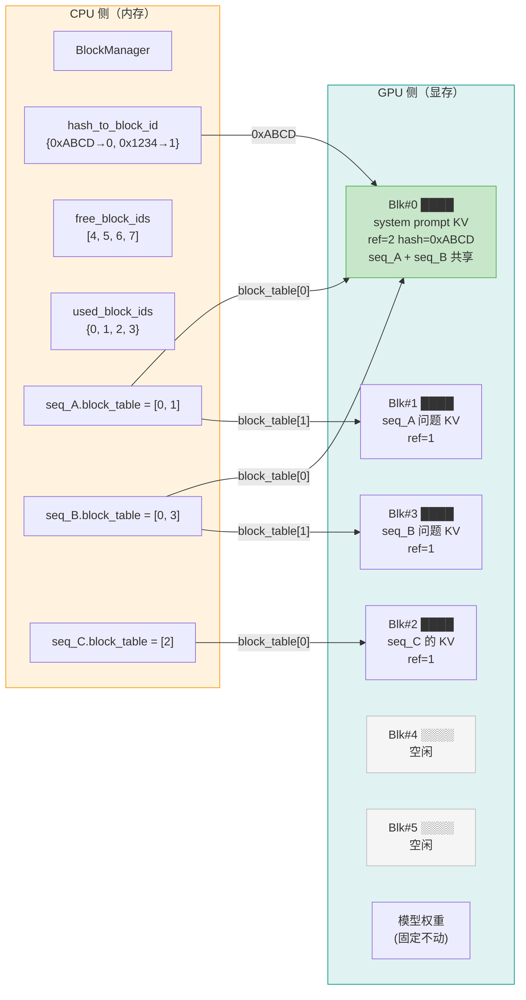

# nano-vllm 架构图

## 一、整体架构

```mermaid
graph TB
    subgraph 用户层
        A["用户代码<br/>llm.generate(prompts, sampling_params)"]
    end

    subgraph 入口层["入口层 (llm.py / config.py)"]
        B["LLM / LLMEngine"]
        C["Config<br/>max_num_seqs=512<br/>max_num_batched_tokens=16384<br/>gpu_memory_utilization=0.9"]
        D["SamplingParams<br/>temperature / max_tokens / ignore_eos"]
    end

    subgraph 引擎层["引擎层 (llm_engine.py)"]
        E["generate() 主循环"]
        F["add_request()<br/>tokenize → Sequence"]
        G["step()<br/>schedule → run → postprocess"]
        H["Tokenizer<br/>(HuggingFace)"]
    end

    subgraph 调度层["调度层 (scheduler.py + sequence.py)"]
        I["Scheduler"]
        J["waiting 队列<br/>(deque)"]
        K["running 队列<br/>(deque)"]
        L["Sequence<br/>状态机: WAITING→RUNNING→FINISHED<br/>token_ids / block_table / status"]
    end

    subgraph 内存层["KV Cache 管理层 (block_manager.py)"]
        M["BlockManager"]
        N["Block 物理块池<br/>ref_count / hash / token_ids"]
        O["hash_to_block_id<br/>前缀缓存索引"]
        P["free_block_ids / used_block_ids"]
    end

    subgraph GPU层["GPU 执行层 (model_runner.py)"]
        Q["ModelRunner"]
        R["prepare_prefill / prepare_decode<br/>组装 input_ids, positions,<br/>cu_seqlens, slot_mapping"]
        S["run_model<br/>普通 forward / CUDA Graph 回放"]
        T["KV Cache 显存<br/>[2, layers, blocks, block_size, heads, dim]"]
    end

    subgraph 模型层["模型层 (qwen3.py + layers/)"]
        U["Qwen3ForCausalLM"]
        V["VocabParallelEmbedding<br/>token_id → 向量"]
        W["Qwen3DecoderLayer × 28<br/>RMSNorm → Attention → FFN"]
        X["Attention<br/>store_kvcache (Triton)<br/>flash_attn_varlen / with_kvcache"]
        Y["张量并行线性层<br/>ColumnParallel / RowParallel<br/>AllReduce (NCCL)"]
        Z["ParallelLMHead<br/>→ logits"]
        AA["Sampler<br/>temperature → Gumbel-max → token_id"]
    end

    subgraph 工具层["工具层 (utils/)"]
        BB["Context 全局黑板<br/>is_prefill / cu_seqlens / slot_mapping"]
        CC["loader.py<br/>safetensors → 权重加载<br/>packed_modules_mapping 名称翻译"]
    end

    A --> B
    B --> C
    B --> D
    B --> E
    E --> F
    F --> H
    F --> L
    E --> G
    G --> I
    I --> J
    I --> K
    I --> M
    M --> N
    M --> O
    M --> P
    G --> Q
    Q --> R
    R --> BB
    Q --> S
    S --> U
    U --> V
    U --> W
    W --> X
    W --> Y
    X --> T
    U --> Z
    Z --> AA
    CC -.->|加载权重| U

    style 用户层 fill:#e8f5e9,stroke:#4caf50
    style 入口层 fill:#e3f2fd,stroke:#2196f3
    style 引擎层 fill:#fff3e0,stroke:#ff9800
    style 调度层 fill:#fce4ec,stroke:#e91e63
    style 内存层 fill:#f3e5f5,stroke:#9c27b0
    style GPU层 fill:#e0f2f1,stroke:#009688
    style 模型层 fill:#fff9c4,stroke:#fbc02d
    style 工具层 fill:#f5f5f5,stroke:#9e9e9e
```

## 二、多请求处理流程（时序图）

```mermaid
sequenceDiagram
    participant User as 用户
    participant Engine as LLMEngine
    participant Sched as Scheduler
    participant BM as BlockManager
    participant MR as ModelRunner
    participant GPU as GPU (显存)

    User->>Engine: generate(["介绍北京", "质数列表", "写首诗"])
    
    Note over Engine: Tokenize 三条 prompt<br/>创建 seq0, seq1, seq2

    Engine->>Sched: add(seq0), add(seq1), add(seq2)
    Note over Sched: waiting=[seq0, seq1, seq2]<br/>running=[]

    rect rgb(232, 245, 233)
        Note over Engine,GPU: ═══ Step 1: Prefill ═══
        Engine->>Sched: schedule()
        Sched->>BM: can_allocate(seq0)? ✓
        BM->>BM: 查哈希：首次无缓存
        BM->>GPU: 分配 Blk#0, Blk#1
        Sched->>BM: can_allocate(seq1)? ✓
        BM->>BM: 查哈希：system prompt 命中！
        Note over BM: seq1.num_cached_tokens=256<br/>Blk#0.ref_count: 1→2
        BM->>GPU: 分配 Blk#2 (问题部分)
        Sched->>BM: can_allocate(seq2)? ✓
        BM->>GPU: 分配 Blk#3
        Note over Sched: waiting=[]<br/>running=[seq0, seq1, seq2]

        Sched-->>Engine: [seq0, seq1, seq2], is_prefill=True
        Engine->>MR: run(seqs, prefill)
        MR->>MR: prepare_prefill()<br/>input_ids (跳过 seq1 缓存部分)<br/>cu_seqlens / slot_mapping
        MR->>GPU: model.forward(input_ids, positions)
        Note over GPU: Embedding → 28层Transformer<br/>写 KV Cache 到 Blk#0~#3<br/>Flash Attention (varlen)
        GPU-->>MR: logits
        MR->>MR: Sampler → [tokenA, tokenB, tokenC]
        MR-->>Engine: [tokenA, tokenB, tokenC]
        Engine->>Sched: postprocess(seqs, tokens)
        Note over Sched: seq0: append(tokenA)<br/>seq1: append(tokenB)<br/>seq2: append(tokenC)<br/>均未结束
    end

    rect rgb(227, 242, 253)
        Note over Engine,GPU: ═══ Step 2: Decode ═══
        Engine->>Sched: schedule()
        Note over Sched: waiting 空 → 跳过 prefill
        Sched->>BM: can_append(seq0)? ✓
        Sched->>BM: can_append(seq1)? ✓
        Sched->>BM: can_append(seq2)? ✓
        Sched-->>Engine: [seq0, seq1, seq2], is_prefill=False

        Engine->>MR: run(seqs, decode)
        MR->>MR: prepare_decode()<br/>input_ids = [last_token × 3]
        MR->>GPU: CUDA Graph replay / model.forward
        Note over GPU: 每条 seq 只算 1 个新 token<br/>读历史 KV Cache<br/>写新 K/V 到对应 slot
        GPU-->>MR: logits
        MR->>MR: Sampler → [tokenD, tokenE, tokenF]
        MR-->>Engine: [tokenD, tokenE, tokenF]
        Engine->>Sched: postprocess(seqs, tokens)
        Note over Sched: seq1 输出了 EOS！<br/>seq1.status=FINISHED
        Sched->>BM: deallocate(seq1)
        BM->>GPU: 释放 Blk#2<br/>Blk#0.ref_count: 2→1
        Note over Sched: running=[seq0, seq2]
    end

    rect rgb(255, 243, 224)
        Note over Engine,GPU: ═══ Step 3: Decode (继续) ═══
        Engine->>Sched: schedule()
        Sched-->>Engine: [seq0, seq2], is_prefill=False
        Engine->>MR: run(seqs, decode)
        MR->>GPU: CUDA Graph replay
        GPU-->>MR: [tokenG, tokenH]
        Engine->>Sched: postprocess
        Note over Sched: 均未结束，继续...
    end

    rect rgb(252, 228, 236)
        Note over Engine,GPU: ═══ Step N: Decode (显存紧张) ═══
        Engine->>Sched: schedule()
        Sched->>BM: can_append(seq0)? ✗ 显存不足！
        Sched->>Sched: preempt(seq2)<br/>踢队尾，代价最小
        Sched->>BM: deallocate(seq2)
        BM->>GPU: 释放 seq2 的块
        Sched->>BM: can_append(seq0)? ✓
        Note over Sched: running=[seq0]<br/>waiting=[seq2] (插回队头)
        Sched-->>Engine: [seq0], is_prefill=False
        Engine->>MR: run([seq0], decode)
        GPU-->>MR: [tokenX]
        Engine->>Sched: postprocess
        Note over Sched: seq0 达到 max_tokens！<br/>seq0.status=FINISHED
        Sched->>BM: deallocate(seq0)
    end

    rect rgb(232, 245, 233)
        Note over Engine,GPU: ═══ Step N+1: 被踢的 seq2 重新 Prefill ═══
        Engine->>Sched: schedule()
        Note over Sched: waiting=[seq2] → prefill 优先
        Sched->>BM: allocate(seq2)
        BM->>BM: 查哈希：前缀缓存可能命中（之前的块还在）
        Sched-->>Engine: [seq2], is_prefill=True
        Engine->>MR: run([seq2], prefill)
        Note over GPU: 重新 prefill seq2<br/>（已生成的 token 也要重新算）
    end

    Note over Engine: ... 继续 decode 直到 seq2 完成 ...

    rect rgb(245, 245, 245)
        Note over Engine,GPU: ═══ 全部完成 ═══
        Note over Engine: outputs[0] = seq0 结果<br/>outputs[1] = seq1 结果<br/>outputs[2] = seq2 结果<br/>按 seq_id 排序 → 保证输入输出顺序一致
        Engine->>Engine: tokenizer.decode() → 文字
        Engine-->>User: ["北京是中国的首都...", "2,3,5,7,11...", "春风又绿江南岸..."]
    end
```

## 三、KV Cache 管理全景

```mermaid
graph LR
    subgraph CPU侧["CPU 侧（内存）"]
        BM2["BlockManager"]
        HT["hash_to_block_id<br/>{0xABCD→0, 0x1234→1}"]
        FREE["free_block_ids<br/>[4, 5, 6, 7]"]
        USED["used_block_ids<br/>{0, 1, 2, 3}"]
        SEQ_A["seq_A.block_table = [0, 1]"]
        SEQ_B["seq_B.block_table = [0, 3]"]
        SEQ_C["seq_C.block_table = [2]"]
    end

    subgraph GPU侧["GPU 侧（显存）"]
        BLK0["Blk#0 ████<br/>system prompt KV<br/>ref=2 hash=0xABCD<br/>seq_A + seq_B 共享"]
        BLK1["Blk#1 ████<br/>seq_A 问题 KV<br/>ref=1"]
        BLK2["Blk#2 ████<br/>seq_C 的 KV<br/>ref=1"]
        BLK3["Blk#3 ████<br/>seq_B 问题 KV<br/>ref=1"]
        BLK4["Blk#4 ░░░░<br/>空闲"]
        BLK5["Blk#5 ░░░░<br/>空闲"]
        WEIGHTS["模型权重<br/>(固定不动)"]
    end

    SEQ_A -->|"block_table[0]"| BLK0
    SEQ_A -->|"block_table[1]"| BLK1
    SEQ_B -->|"block_table[0]"| BLK0
    SEQ_B -->|"block_table[1]"| BLK3
    SEQ_C -->|"block_table[0]"| BLK2
    HT -->|"0xABCD"| BLK0

    style CPU侧 fill:#fff3e0,stroke:#ff9800
    style GPU侧 fill:#e0f2f1,stroke:#009688
    style BLK0 fill:#c8e6c9,stroke:#4caf50
    style BLK4 fill:#f5f5f5,stroke:#bdbdbd
    style BLK5 fill:#f5f5f5,stroke:#bdbdbd
```
