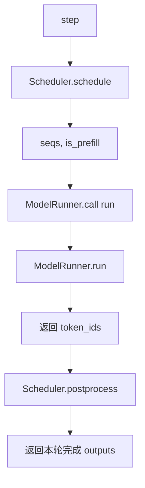

# Nano-vLLM 详细设计

## 1. 文档目的

> 基于 bb823b3e06983d71485a8e1f23715ebd87d98ef8

本文档面向需要阅读、维护或扩展 Nano-vLLM 推理引擎的开发者，详细说明请求调度、KV cache 管理、模型执行、attention 上下文、tensor parallel 和采样等核心设计。

相关代码入口：

- `nanovllm/llm.py`
- `nanovllm/engine/llm_engine.py`
- `nanovllm/engine/scheduler.py`
- `nanovllm/engine/block_manager.py`
- `nanovllm/engine/model_runner.py`
- `nanovllm/layers/attention.py`
- `nanovllm/models/qwen3.py`

## 2. 核心数据结构

### 2.1 `Config`

`Config` 是引擎全局配置，主要字段包括：

- `model`：本地模型目录；
- `max_num_batched_tokens`：prefill 阶段单批最多 token 数；
- `max_num_seqs`：单批最多 sequence 数；
- `max_model_len`：最大模型上下文长度，会与 HF config 的 `max_position_embeddings` 取较小值；
- `gpu_memory_utilization`：用于计算可分配 KV cache 的显存比例；
- `tensor_parallel_size`：tensor parallel 并行度；
- `enforce_eager`：是否禁用 CUDA Graph；
- `kvcache_block_size`：KV cache block 大小；
- `num_kvcache_blocks`：运行时根据显存计算得到。

初始化时会读取 Hugging Face `AutoConfig`，并检查模型目录、block size 和 tensor parallel size。

### 2.2 `SamplingParams`

`SamplingParams` 描述每个请求的采样参数：

- `temperature`：采样温度；
- `max_tokens`：最大生成 token 数；
- `ignore_eos`：是否忽略 EOS。

当前实现要求 `temperature > 1e-10`，即不支持 greedy sampling。

### 2.3 `Sequence`

`Sequence` 是请求运行时状态，核心字段如下：

- `seq_id`：全局递增请求 ID；
- `status`：`WAITING`、`RUNNING` 或 `FINISHED`；
- `token_ids`：prompt token 与已生成 token；
- `last_token`：当前最后一个 token，decode 阶段作为输入；
- `num_tokens`：当前总 token 数；
- `num_prompt_tokens`：prompt token 数；
- `num_cached_tokens`：已经在 KV cache 中、不需要 prefill 的 token 数；
- `num_scheduled_tokens`：本轮调度需要处理的 token 数；
- `is_prefill`：当前是否处于 prefill / re-prefill 阶段，影响跨进程 pickle 时传输完整 token 序列还是只传最后一个 token；
- `block_table`：逻辑 block 到物理 KV block 的映射；
- `temperature`、`max_tokens`、`ignore_eos`：采样控制参数。

重要属性：

- `num_completion_tokens = num_tokens - num_prompt_tokens`；
- `num_blocks = ceil(num_tokens / block_size)`；
- `last_block_num_tokens`：最后一个逻辑 block 中已有 token 数；
- `block(i)`：取第 `i` 个逻辑 block 对应的 token ids。

`__getstate__` 和 `__setstate__` 用于跨进程 pickle。`is_prefill=True` 时需要传完整 `token_ids`，因为 prefill / re-prefill 可能要重新切片历史 token；`is_prefill=False` 的 decode 阶段只传 `last_token`，减少 shared memory 中传输的数据量。

## 3. 对外接口流程

### 3.1 `LLM`

`LLM` 当前只是 `LLMEngine` 的薄封装：

```python
class LLM(LLMEngine):
    pass
```

用户通过如下方式使用：

```python
llm = LLM(model_path, enforce_eager=True, tensor_parallel_size=1)
outputs = llm.generate(prompts, sampling_params)
```

### 3.2 `LLMEngine.__init__`

初始化流程：

1. 从传入参数中筛选 `Config` 支持的字段。
2. 创建 `Config`。
3. 将 `Sequence.block_size` 设置为 `config.kvcache_block_size`。
4. 若 `tensor_parallel_size > 1`，使用 spawn 启动 rank 1 到 rank N-1 的 `ModelRunner` 子进程。
5. 在主进程创建 rank 0 的 `ModelRunner`。
6. 加载 tokenizer。
7. 设置 EOS token id。
8. 创建 `Scheduler`。
9. 注册退出清理逻辑。

### 3.3 `LLMEngine.generate`

`generate()` 是离线批量推理主循环：

1. 统一采样参数列表。
2. 对每个 prompt 调用 `add_request()`。
3. 循环执行 `step()`，直到 `scheduler.is_finished()`。
4. 记录 prefill / decode throughput。
5. 收集完成 sequence 的 completion token ids。
6. 按 `seq_id` 排序，保持输出顺序与输入顺序一致。
7. 使用 tokenizer decode completion token ids。

### 3.4 `LLMEngine.step`

单步执行流程：



`num_tokens` 的含义：

- prefill 时为本轮调度的 token 总数；
- decode 时为负的 sequence 数，用于统计 decode throughput。

## 4. 调度器设计

### 4.1 队列模型

`Scheduler` 维护两个队列：

- `waiting`：等待 prefill 的请求；
- `running`：已经完成 prefill、可以 decode 的请求。

新增请求始终进入 `waiting`：

```python
self.waiting.append(seq)
```

### 4.2 prefill 调度

prefill 阶段优先级高于 decode。只要本轮能调度至少一个 waiting sequence，`schedule()` 就返回 prefill batch。

核心逻辑：

1. 从 `waiting[0]` 开始检查。
2. 计算本轮剩余 token budget：

```python
remaining = max_num_batched_tokens - num_batched_tokens
```

3. 如果 sequence 还没有 `block_table`，先调用 `BlockManager.can_allocate(seq)`。它返回命中的完整 prefix cache block 数；返回 `-1` 表示扣除可复用 block 后仍没有足够空闲 block。
4. 对首次分配的 sequence，待 prefill token 数为：

```python
num_tokens = seq.num_tokens - num_cached_blocks * block_size
```

对已经分配过 block、正在继续 chunked prefill 的 sequence，待 prefill token 数为：

```python
num_tokens = seq.num_tokens - seq.num_cached_tokens
```

5. 如果本轮剩余 token budget 不够，且本轮已经有其他 sequence 被调度，则停止。该实现只允许 batch 中第一个 sequence 做 chunked prefill。
6. 如果尚未分配 block，则调用 `BlockManager.allocate(seq, num_cached_blocks)`，复用命中的 blocks，并为未命中部分分配新 blocks。
7. 设置 `seq.num_scheduled_tokens = min(num_tokens, remaining)`。
8. 若 `seq.num_cached_tokens + seq.num_scheduled_tokens == seq.num_tokens`，说明本次 prefill 已覆盖完整上下文，将 sequence 从 waiting 移到 running。

chunked prefill 情况下，sequence 会被调度执行一部分 token，但仍留在 waiting 队首，下一轮继续 prefill。

### 4.3 decode 调度

当没有 prefill 可执行时，进入 decode。

decode 阶段：

1. 从 `running` 队首取 sequence。
2. 调用 `BlockManager.can_append(seq)` 判断追加一个 token 是否需要新 block，以及是否有空闲 block。
3. 如果 KV cache 不足，触发抢占。
4. 如果可以追加，则设置 `seq.num_scheduled_tokens = 1`。
5. 设置 `seq.is_prefill = False`，使跨进程传输只携带 `last_token`。
6. 调用 `BlockManager.may_append(seq)`，在进入新 block 时提前分配物理 block。
7. 将 sequence 放入 `scheduled_seqs`。

本轮 decode 完成调度后：

```python
self.running.extendleft(reversed(scheduled_seqs))
```

这会把本轮成功调度的 sequence 按原顺序放回 running 队首，下一轮继续优先 decode。

### 4.4 抢占策略

KV cache 不足时：

- 如果 running 队列中还有其他 sequence，优先抢占队尾 sequence；
- 如果没有其他 sequence，则抢占当前 sequence。

抢占动作：

```python
seq.status = SequenceStatus.WAITING
seq.is_prefill = True
self.block_manager.deallocate(seq)
self.waiting.appendleft(seq)
```

抢占会释放该 sequence 的 KV cache，并将它放回 waiting 队首。之后它需要重新 prefill 来恢复 KV cache。恢复过程如果被切成多个 chunk，`postprocess()` 只在上下文全部恢复后才追加新的采样 token。

### 4.5 后处理

`postprocess(seqs, token_ids, is_prefill)` 负责将模型输出写回 sequence 状态。

后处理先固化本轮新写满的完整 cache blocks：

```python
self.block_manager.hash_blocks(seq)
```

随后更新 cached token 进度并清空本轮调度计数：

```python
seq.num_cached_tokens += seq.num_scheduled_tokens
seq.num_scheduled_tokens = 0
```

如果当前是 prefill 且 `num_cached_tokens < num_tokens`，说明 chunked prefill 尚未覆盖完整上下文，本轮只更新 KV cache，不追加采样 token。

否则，将采样得到的 `token_id` 追加到 sequence：

```python
seq.append_token(token_id)
```

最后检查 EOS 或最大生成长度，若完成则释放 KV cache 并从 running 队列移除。

## 5. BlockManager 与 KV Cache 设计

### 5.1 Block 状态

每个物理 block 保存：

- `block_id`：物理 block 编号；
- `ref_count`：引用计数；
- `hash`：完整 block 的 prefix hash，`-1` 表示未固化；
- `token_ids`：该 block 对应 token 内容，用于 hash 命中后再校验。

`reset()` 将 block 初始化为已被一个 sequence 引用，且 hash 未固化。

### 5.2 KV cache block 分配

KV cache 分配分为两步：`can_allocate(seq)` 先判断 cache 命中和容量，`allocate(seq, num_cached_blocks)` 再真正建立 `block_table`。

`can_allocate(seq)` 的处理流程：

1. 只遍历 `seq.num_blocks - 1` 个完整逻辑 block，最后一个未满 block 不参与 prefix cache 命中。
2. 对每个完整 block 计算包含 prefix hash 的 block hash。
3. 在 `hash_to_block_id` 中查找可复用物理 block。
4. 若没有命中，或命中的 block token ids 不一致，则停止继续匹配。
5. 统计 `num_cached_blocks`。
6. 如果命中的物理 block 当前仍在使用，则这部分不需要新增空闲 block，只需要增加引用计数。
7. 若空闲 block 数不足以覆盖未命中部分，返回 `-1`；否则返回 `num_cached_blocks`。

`allocate(seq, num_cached_blocks)` 的处理流程：

1. 对前 `num_cached_blocks` 个逻辑 block，从 `hash_to_block_id` 找到已有物理 block。
2. 如果物理 block 正在使用，则增加 `ref_count`。
3. 如果物理 block 当前空闲，则从 `free_block_ids` 中移除并加入 `used_block_ids`，相当于重新激活该 cache block。
4. 对未命中的剩余逻辑 block，调用 `_allocate_block()` 分配新的物理 block。
5. 将所有物理 block id 追加到 `seq.block_table`。
6. 设置 `seq.num_cached_tokens = num_cached_blocks * block_size`。

token ids 二次校验是为了避免 hash 冲突导致错误复用。

当 `_allocate_block()` 复用一个带旧 hash 的空闲 block 存放新内容时，会先删除 `hash_to_block_id` 中指向该 block 的旧映射，再重置 block 状态，避免后续 prefix cache 命中已经被改写的物理 block。

### 5.3 KV cache 释放

`deallocate(seq)` 逆序遍历 `seq.block_table`：

1. 每个 block 的 `ref_count -= 1`。
2. 如果引用计数归零，则从 used 集合移除，并加入 free 队列。
3. 清空 `seq.num_cached_tokens`。
4. 清空 `seq.block_table`。

注意：释放物理 block 时并不会清空 block 的 `hash` 和 `token_ids`。这使得 prefix cache 索引仍可找到该 block。下次若命中且 block 当前未使用，`allocate()` 会把它从 `free_block_ids` 移回 `used_block_ids` 并重新设置引用计数。

### 5.4 append 前检查

`can_append(seq)` 判断 decode 追加一个 token 是否需要新 block：

```python
return len(self.free_block_ids) >= (len(seq) % self.block_size == 1)
```

当 `len(seq) % block_size == 1` 时，说明 sequence 当前刚进入一个新 block 的第一个 token 位置，需要额外空闲物理 block。

### 5.5 `may_append(seq)`

`may_append()` 在真正 `append_token()` 前执行，只负责在 decode 即将进入新 block 时分配物理 block：

```python
if len(seq) % self.block_size == 1:
    seq.block_table.append(self._allocate_block())
```

当 `len(seq) % block_size == 1` 时，当前 `last_token` 位于新 block 的第一个位置。该 block 在前一次追加 token 后才变成当前最后一个 block，因此 decode 前必须提前补一个物理 block，保证当前 token 的 K/V 有可写入的 slot。

### 5.6 `hash_blocks(seq)`

`hash_blocks()` 在 `Scheduler.postprocess()` 中调用，用来固化本轮新写满的完整 block：

```python
start = seq.num_cached_tokens // block_size
end = (seq.num_cached_tokens + seq.num_scheduled_tokens) // block_size
```

`start` 到 `end` 之间表示本轮从未缓存变为已缓存、且已经完整填满的 block。函数会从前一个 block 的 hash 继续滚动计算 prefix-aware hash，然后调用 `block.update(h, token_ids)` 并写入 `hash_to_block_id`。

未满 block 不会进入 `hash_to_block_id`。这样可以避免 chunked prefill 或 decode 中尚未填满的 block 被 prefix cache 错误复用。

## 6. ModelRunner 设计

### 6.1 初始化

每个 `ModelRunner` 对应一个 tensor parallel rank。

初始化步骤：

1. 初始化 NCCL process group。
2. 设置当前 CUDA device。
3. 根据 HF config 推断模型 dtype。
4. 构建 `Qwen3ForCausalLM`。
5. 加载 safetensors 权重。
6. 创建 `Sampler`。
7. warmup 模型。
8. 分配 KV cache。
9. 若 `enforce_eager=False`，捕获 CUDA Graph。
10. 若当前 rank 不是 0，则进入 shared memory 事件循环。

### 6.2 shared memory 调用模型

rank 0 作为主控：

- 将方法名和参数 pickle 到 shared memory；
- 触发其他 rank 的 event；
- 自己也执行同名方法。

其他 rank：

- 等待 event；
- 从 shared memory 读取方法名和参数；
- 调用本地方法；
- 清空 event；
- 收到 `exit` 后退出循环。

这种方式让 `LLMEngine` 只需调用 rank 0 的 `model_runner.call()`，即可驱动所有 tensor parallel rank 同步执行。

### 6.3 KV cache 张量分配

`allocate_kv_cache()` 根据显存估算可分配 block 数。

每个 block 所需字节数：

```text
2 * num_hidden_layers * block_size * num_kv_heads_per_rank * head_dim * dtype_size
```

其中 `2` 分别对应 K cache 和 V cache。

最终 KV cache 张量形状：

```text
[2, num_hidden_layers, num_kvcache_blocks, block_size, num_kv_heads_per_rank, head_dim]
```

随后遍历模型模块，将每层 attention 的 `k_cache` 和 `v_cache` 绑定到对应 layer 的 KV cache slice。

### 6.4 prefill 输入准备

`prepare_prefill(seqs)` 生成：

- `input_ids`：本轮需要 forward 的 token ids；
- `positions`：对应 position ids；
- `cu_seqlens_q`：query 的累积长度；
- `cu_seqlens_k`：key/value 的累积上下文长度；
- `max_seqlen_q`：batch 中最大 query 长度；
- `max_seqlen_k`：batch 中最大 key/value 长度；
- `slot_mapping`：每个输入 token 的 K/V 写入物理 slot；
- `block_tables`：prefix cache 命中时需要的 block table。

对于每个 sequence：

1. `start = num_cached_tokens`，从尚未缓存的第一个 token 开始。
2. `end = start + num_scheduled_tokens`。
3. `seqlen_q = num_scheduled_tokens`，表示本轮 query token 数。
4. `seqlen_k = end`，表示本轮 attention 可见的 key/value 上下文只到当前 chunk 结束位置。
5. `input_ids` 取 `[start, end)`。
6. `positions` 取 `range(start, end)`。
7. 根据 `block_table` 和 block 边界计算 `slot_mapping`。

如果 `cu_seqlens_k[-1] > cu_seqlens_q[-1]`，说明 key/value 上下文比本轮 query 更长，即存在 prefix cache 或历史 KV，需要准备 `block_tables`。

### 6.5 decode 输入准备

`prepare_decode(seqs)` 对每个 sequence 只准备最后一个 token：

- `input_ids.append(seq.last_token)`；
- `positions.append(len(seq) - 1)`；
- `context_lens.append(len(seq))`；
- `slot_mapping` 指向当前 token 在物理 KV cache 中的写入 slot；
- `block_tables` 提供完整历史 KV 的物理 block 映射。

decode 的 `slot_mapping` 计算方式：

```python
seq.block_table[-1] * block_size + seq.last_block_num_tokens - 1
```

含义是：最后一个物理 block 起始 slot 加上当前 token 在该 block 内的 offset。

### 6.6 运行模型与采样

`run(seqs, is_prefill)` 是模型执行入口：

1. 根据阶段调用 `prepare_prefill()` 或 `prepare_decode()`。
2. rank 0 准备采样温度。
3. 调用 `run_model()`。
4. rank 0 用 `Sampler` 从 logits 中采样 token ids。
5. 清空全局 context。
6. 返回 token ids。

`run_model()` 在以下情况走普通 forward：

- prefill；
- `enforce_eager=True`；
- decode batch size 大于 512。

其他 decode 场景走 CUDA Graph replay。

## 7. Attention 与 Context 设计

### 7.1 全局 Context

`nanovllm/utils/context.py` 提供一个进程内全局 `Context`，用于把调度阶段准备好的元数据传给 attention 和 LM head。

字段包括：

- `is_prefill`；
- `cu_seqlens_q` / `cu_seqlens_k`；
- `max_seqlen_q` / `max_seqlen_k`；
- `slot_mapping`；
- `context_lens`；
- `block_tables`。

`ModelRunner.prepare_prefill()` 和 `prepare_decode()` 会调用 `set_context()`；`run()` 结束后调用 `reset_context()`。

### 7.2 KV cache 写入

`Attention.forward()` 会先调用 `store_kvcache()`：

```python
store_kvcache(k, v, k_cache, v_cache, context.slot_mapping)
```

`store_kvcache_kernel` 是 Triton kernel。它对每个输入 token：

1. 从 `slot_mapping` 读取物理 slot；
2. 如果 slot 为 `-1` 则跳过；
3. 将该 token 的 key / value 写入 `k_cache` / `v_cache` 对应位置。

### 7.3 attention 后端

attention 后端由环境变量 `NANOVLLM_ATTENTION_BACKEND` 控制：

- `auto`：优先 FlashAttention，否则 SDPA；
- `flash`：强制 FlashAttention；
- `sdpa`：强制 PyTorch SDPA。

FlashAttention 路径：

- prefill 使用 `flash_attn_varlen_func`；
- decode 使用 `flash_attn_with_kvcache`；
- prefix cache 时将 `k` / `v` 替换为全局 KV cache，并传入 `block_table`。

SDPA 路径：

- 通过 `block_table` 从 cache 中 gather K/V；
- 构造 causal mask；
- 调用 `torch.nn.functional.scaled_dot_product_attention`；
- 若旧版本 PyTorch 不支持 `enable_gqa`，则手动 repeat KV heads。

### 7.4 LM Head 的 prefill 输出裁剪

`ParallelLMHead.forward()` 在 prefill 阶段只保留每个 sequence 的最后一个 query 位置：

```python
last_indices = context.cu_seqlens_q[1:] - 1
x = x[last_indices].contiguous()
```

这样即使 prefill 计算了多个 token 的 hidden states，也只对每个 sequence 最后位置计算 logits，用于采样下一个 token。

## 8. 模型结构设计

### 8.1 Qwen3ForCausalLM

`Qwen3ForCausalLM` 由两部分组成：

- `Qwen3Model`：decoder-only transformer；
- `ParallelLMHead`：并行词表输出层。

当 `tie_word_embeddings=True` 时，LM head 权重与 embedding 权重共享。

### 8.2 Qwen3Model

模型 forward 流程：

1. `VocabParallelEmbedding` 将 input ids 映射为 hidden states。
2. 逐层执行 `Qwen3DecoderLayer`。
3. 最后执行 RMSNorm。
4. 返回 hidden states。

### 8.3 Qwen3DecoderLayer

decoder layer 包含：

- input RMSNorm；
- self attention；
- post-attention RMSNorm；
- MLP。

RMSNorm 支持 residual 融合，减少额外张量操作。

### 8.4 Qwen3Attention

attention 层流程：

1. `QKVParallelLinear` 一次性生成 q/k/v；
2. reshape 为 `[tokens, heads, head_dim]`；
3. 对 q/k 做 RMSNorm；
4. 应用 RoPE；
5. 调用 `Attention` 执行 KV cache 写入和 attention；
6. 使用 `RowParallelLinear` 生成输出。

### 8.5 MLP

MLP 使用 gated SiLU：

1. `MergedColumnParallelLinear` 同时生成 gate 和 up；
2. `SiluAndMul` 执行 `silu(gate) * up`；
3. `RowParallelLinear` 投影回 hidden size。

## 9. Tensor Parallel 设计

### 9.1 Linear 分片

项目实现了几类 tensor parallel linear：

- `ColumnParallelLinear`：按输出维度切分权重；
- `MergedColumnParallelLinear`：支持 gate/up 或其他合并矩阵的列并行加载；
- `QKVParallelLinear`：支持 q/k/v packed 权重加载与分片；
- `RowParallelLinear`：按输入维度切分权重，forward 后 `all_reduce` 汇总结果。

### 9.2 Embedding 与 LM Head

`VocabParallelEmbedding` 按词表维度切分：

- 每个 rank 只保存部分词表 embedding；
- forward 时 mask 出当前 rank 负责的 token；
- 多 rank 输出通过 `all_reduce` 合并。

`ParallelLMHead` 复用词表并行逻辑：

- 每个 rank 计算局部 vocab logits；
- rank 0 gather 所有 rank 的 logits；
- rank 0 拼接完整词表 logits 并采样。

### 9.3 权重加载

`load_model()` 遍历模型目录下 safetensors 文件。

对于 Qwen3 packed modules：

- `q_proj` / `k_proj` / `v_proj` 映射到 `qkv_proj`；
- `gate_proj` / `up_proj` 映射到 `gate_up_proj`。

每个 parameter 可挂载自定义 `weight_loader`，用于根据 rank 和 shard id 加载对应权重切片。

## 10. 采样设计

`Sampler.forward()` 使用 temperature sampling：

1. logits 转 float 并除以 temperature；
2. softmax 得到概率；
3. 使用 exponential noise 实现 Gumbel-max 风格采样；
4. 取 argmax 作为采样 token。

采样只在 rank 0 执行，其他 rank 返回 `None`。

## 11. CUDA Graph 设计

非 eager 模式下，`ModelRunner.capture_cudagraph()` 为一组 batch size 捕获 decode graph：

```text
1, 2, 4, 8, 16, 32, ..., max_bs
```

捕获时准备固定形状的：

- `input_ids`；
- `positions`；
- `slot_mapping`；
- `context_lens`；
- `block_tables`；
- `outputs`。

decode 执行时：

1. 找到第一个大于等于当前 batch size 的 graph；
2. 将当前 batch 数据写入 graph vars；
3. 对未使用位置填默认值；
4. `graph.replay()`；
5. 取前 `bs` 个输出计算 logits。

prefill 不使用 CUDA Graph，因为 prefill token 长度、累积长度和 batch 形态变化较大。

## 12. 关键流程详解

### 12.1 普通请求首次 prefill

1. 请求进入 waiting。
2. `Scheduler.schedule()` 选中该请求。
3. `BlockManager.can_allocate(seq)` 检查 prefix cache 命中和空闲 block 是否足够。
4. `BlockManager.allocate(seq, num_cached_blocks)` 分配 block table。
5. `ModelRunner.prepare_prefill()` 生成 input ids、positions、slot mapping。
6. `Attention.forward()` 将 K/V 写入 cache。
7. `ParallelLMHead` 只取最后 token 的 hidden state 计算 logits。
8. `Sampler` 采样第一个 completion token。
9. `Scheduler.postprocess()` 固化新完成的 block hash，并 append token。
10. sequence 留在 running，等待 decode。

### 12.2 prefix cache 命中 prefill

1. `BlockManager.can_allocate()` 遍历除最后一个 block 外的完整 block。
2. 对完整 block 计算 prefix-aware hash。
3. 如果 `hash_to_block_id` 命中且 token ids 一致，计入 `num_cached_blocks`。
4. `BlockManager.allocate(seq, num_cached_blocks)` 复用命中的物理 block，并为未命中部分分配新 block。
5. `seq.num_cached_tokens = num_cached_blocks * block_size`。
6. `prepare_prefill()` 从 `num_cached_tokens` 开始准备 query。
7. 若 key/value 上下文长度大于 query 长度，则准备 `block_tables`。
8. attention 先把本轮新增 K/V 写入 cache，再通过 `block_tables` 读取完整上下文 KV。

### 12.3 chunked prefill

1. 当 waiting 队首请求需要 prefill 的 token 数超过本轮剩余 budget 时，允许它只执行一部分。
2. `seq.num_scheduled_tokens` 小于待 prefill token 数。
3. `prepare_prefill()` 设置 `seqlen_k = num_cached_tokens + num_scheduled_tokens`，避免 attention 看见尚未计算的未来 token。
4. 本轮 forward 后，`postprocess()` 先通过 `hash_blocks()` 固化新写满的完整 block，再更新 `num_cached_tokens`。
5. 因 `num_cached_tokens < num_tokens`，不会 append 新 token。
6. sequence 继续留在 waiting，下一轮继续 prefill。

### 12.4 decode 生成一个 token

1. `Scheduler` 从 running 队首取 sequence。
2. `can_append()` 检查是否需要新 block。
3. `seq.is_prefill` 置为 `False`，跨进程只传 `last_token`。
4. `may_append()` 在需要时提前分配新 block。
5. `prepare_decode()` 将 `last_token` 作为输入。
6. `slot_mapping` 指向当前 token 的 KV 写入位置。
7. `block_tables` 提供全部历史 KV 的 block 映射。
8. attention 写入当前 token K/V，并读取历史 K/V 做 causal attention。
9. sampler 生成下一个 token。
10. postprocess 固化新写满的 block、append token，并判断是否完成。

### 12.5 抢占后重新 prefill

1. decode 时 KV cache 不足。
2. scheduler 抢占 running 队尾或当前 sequence。
3. `seq.is_prefill` 置为 `True`，后续跨进程重新传完整 token 序列。
4. `BlockManager.deallocate()` 释放该 sequence 的 block table 和 cached token 计数。
5. sequence 被放回 waiting 队首。
6. 后续 prefill 重新分配 block 并恢复历史 KV。
7. 如果恢复过程被 chunked prefill 切分，`postprocess()` 会在 `num_cached_tokens < num_tokens` 时只更新 cache，不 append 新 token；恢复到完整上下文后才 append 本轮采样 token。

## 13. 边界条件与注意事项

- `block_table` 为空只应出现在尚未分配 KV cache 或 warmup 场景。
- `hash == -1` 表示 block 未固化，不应作为 prefix cache 复用依据。
- 只有完整 block 才会计算 hash 并加入 `hash_to_block_id`；`can_allocate()` 不尝试命中最后一个可能未满的 block。
- block hash 在 `postprocess()` 中按本轮新完成的完整 block 固化，而不是在 decode append 前即时固化。
- `slot_mapping == -1` 表示该 token 不写入 KV cache。
- `prepare_block_tables()` 会用 `-1` padding 到同一长度，以便构造二维 GPU tensor。
- decode 阶段 `context_lens` 控制真实上下文长度，padding block 不应被读取。
- `is_prefill` 控制跨进程序列化内容：prefill / re-prefill 传完整 token ids，decode 只传 `last_token`。
- running 队列回插到队首会形成持续优先级，吞吐和先到请求延迟较友好，但公平性较弱。
- 抢占会清空被抢占 sequence 的 `block_table` 和 `num_cached_tokens`，因此需要重新 prefill。
- shared memory 大小固定为 `2**20`，极端大 batch 元数据可能受限。
- `Sampler` 不支持 greedy；如需 greedy，需要修改 `SamplingParams` 约束和采样逻辑。

## 14. 可扩展点

后续可扩展方向：

- 增加 greedy、top-k、top-p、presence penalty 等采样能力；
- 引入更公平的 running 队列轮转策略；
- 支持在线流式输出；
- 增加请求取消和超时；
- 支持更多模型结构；
- 增强 prefix cache 淘汰策略和指标统计；
- 增加 KV cache 压力下的更细粒度抢占策略；
- 将全局 context 改造为更显式的 per-forward context；
- 增加单元测试和端到端推理一致性测试；
- 为 CUDA Graph、FlashAttention 和 SDPA 路径补充兼容性验证。
