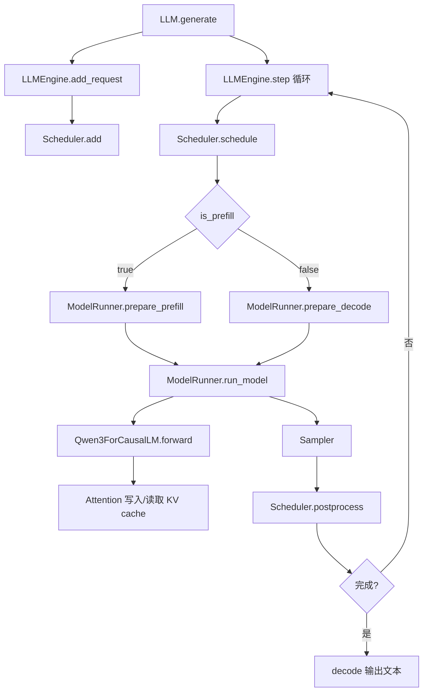

# Nano-vLLM 概要设计

## 1. 背景与目标

> 基于 bb823b3e06983d71485a8e1f23715ebd87d98ef8

Nano-vLLM 是一个从零实现的轻量级 vLLM 风格离线推理引擎。项目目标是在保持代码可读性的前提下，实现接近 vLLM 的推理吞吐能力，并覆盖大模型推理中的核心机制：

- 批量离线生成接口；
- prefill 与 decode 分阶段调度；
- KV cache 分块管理；
- prefix cache 复用；
- tensor parallel 模型并行；
- FlashAttention / SDPA attention 后端；
- Torch 编译与 CUDA Graph decode 加速。

系统主要面向 Qwen3 CausalLM 模型，入口 API 与 vLLM 类似，通过 `LLM.generate()` 接收 prompt 与采样参数，返回生成文本和 token ids。

## 2. 设计范围

本文档覆盖 `nanovllm` 包内推理链路的概要设计，包括：

- 对外 API 与请求生命周期；
- 引擎、调度器、模型执行器和 KV cache 管理器的职责划分；
- prefill / decode 两阶段推理模型；
- block-based KV cache 与 prefix cache；
- tensor parallel 进程模型；
- 模型结构、attention 后端与采样策略。

本文档不覆盖训练、在线服务、流式输出、多模型管理、动态 LoRA、复杂调度策略和生产级容错。

## 3. 总体架构

系统按职责可划分为五层：

- API 层：`LLM` / `LLMEngine`，负责接收请求、tokenize、循环驱动推理并返回结果。
- 调度层：`Scheduler`，负责维护 waiting / running 队列，决定本轮执行 prefill 还是 decode。
- 内存层：`BlockManager`，负责 KV cache block 分配、释放、引用计数和 prefix cache 索引。
- 执行层：`ModelRunner`，负责模型加载、KV cache 张量分配、输入张量准备、模型 forward、采样和 CUDA Graph。
- 模型层：`Qwen3ForCausalLM` 与 layers，负责 transformer 计算、attention、tensor parallel linear 和 logits 输出。

整体调用链如下：

## 4. 核心模块职责

### 4.1 `LLM` 与 `LLMEngine`

`LLM` 是对外暴露的接口类，目前直接继承 `LLMEngine`。

`LLMEngine` 负责：

- 创建 `Config`；
- 初始化 tensor parallel 子进程；
- 创建 rank 0 的 `ModelRunner`；
- 加载 tokenizer；
- 创建 `Scheduler`；
- 将 prompt 封装为 `Sequence` 并加入 waiting 队列；
- 在 `generate()` 中循环调用 `step()`，直到所有请求完成；
- 将完成的 completion token ids 解码为文本。

### 4.2 `Sequence`

`Sequence` 是单个请求的运行时状态对象，保存：

- `token_ids`：prompt 与已生成 token 的完整序列；
- `num_prompt_tokens`：prompt 长度；
- `num_cached_tokens`：已经可复用、不需要重新 prefill 的 token 数；
- `num_scheduled_tokens`：本轮被调度执行的 token 数；
- `is_prefill`：跨进程传输时标记当前是否处于 prefill，用于决定传完整 token 序列还是只传最后一个 token；
- `block_table`：逻辑 block 到物理 KV cache block 的映射；
- 采样参数和完成状态。

### 4.3 `Scheduler`

`Scheduler` 维护两个队列：

- `waiting`：尚未完成 prefill，或被抢占后需要重新 prefill 的请求；
- `running`：已经具备可 decode 状态的请求。

调度策略是：

- 优先执行 prefill；
- 首次调度 waiting sequence 时先查询 prefix cache 命中了多少完整 block；
- 若有 prefill 任务，本轮只返回 prefill batch；
- 没有 prefill 任务时进入 decode；
- decode 阶段每个 sequence 每轮只生成一个 token；
- KV cache 不足时从 running 队尾抢占请求，释放其 KV cache，并放回 waiting 队首。

### 4.4 `BlockManager`

`BlockManager` 将 KV cache 划分为固定大小 block，并维护：

- `free_block_ids`：空闲物理 block；
- `used_block_ids`：已使用物理 block；
- `hash_to_block_id`：prefix cache hash 到物理 block 的索引；
- `Block.ref_count`：支持多个 sequence 共享相同 prefix block。

它提供 block 分配、释放、append 前检查和完整 block hash 固化能力。prefix cache 只复用完整 block；未满 block 会先分配物理位置，但不会写入稳定 hash 索引。

### 4.5 `ModelRunner`

`ModelRunner` 是模型执行核心，负责：

- 初始化 torch distributed / NCCL；
- 设置 CUDA device 与默认 dtype；
- 构建 Qwen3 模型并加载 safetensors 权重；
- warmup 模型；
- 根据剩余显存分配 KV cache；
- 为每一层 attention 绑定 `k_cache` / `v_cache`；
- 准备 prefill / decode 输入张量；
- 设置全局推理上下文；
- 执行模型 forward；
- 在 rank 0 上采样生成 token；
- 可选捕获和重放 CUDA Graph。

### 4.6 模型与算子层

模型层实现 Qwen3 decoder-only 架构：

- `Qwen3ForCausalLM`：模型主体与 LM Head；
- `Qwen3Model`：embedding、多层 decoder、最终 RMSNorm；
- `Qwen3DecoderLayer`：attention + MLP；
- `Qwen3Attention`：QKV projection、RoPE、attention 输出；
- `Attention`：KV cache 写入、FlashAttention 或 SDPA attention 执行；
- parallel linear / embedding / LM head：支持 tensor parallel。

## 5. 请求生命周期

请求从 `generate()` 进入系统后，生命周期如下：

1. prompt 被 tokenizer 编码为 token ids。
2. token ids 与 `SamplingParams` 被封装为 `Sequence`。
3. `Sequence` 加入 `Scheduler.waiting`。
4. `Scheduler.schedule()` 优先调度 waiting 请求做 prefill。
5. `BlockManager.can_allocate()` 计算 prefix cache 命中的完整 block 数，并检查剩余 block 是否足够。
6. `BlockManager.allocate()` 为请求复用命中的 cache blocks，并为未命中部分分配新 blocks。
7. `ModelRunner.prepare_prefill()` 生成 input ids、position ids、slot mapping 和 attention 上下文。
8. 模型 forward 写入 KV cache，并为每个 sequence 输出最后位置 logits。
9. `Scheduler.postprocess()` 固化新完成的 cache block hash、更新 cached token 数、追加生成 token 或标记完成。
10. 完成 prefill 的 sequence 移入 running，后续进入 decode。
11. decode 每轮为每个 running sequence 生成一个 token。
12. 达到 EOS 或 `max_tokens` 后释放 KV cache，返回 completion。

## 6. 推理阶段设计

### 6.1 Prefill

prefill 阶段处理 prompt 或被抢占后需要恢复的历史 token。它的特点是：

- 可以一次处理多个 token；
- 受 `max_num_batched_tokens` 限制；
- 支持 chunked prefill；
- 支持 prefix cache，跳过已经缓存的完整 block；
- `q` 只覆盖本轮新增 token，`k/v` 上下文长度到当前 chunk 结束位置为止；
- 会生成当前 sequence 的第一个 completion token，但 chunked prefill 或抢占恢复时不会追加新 token。

### 6.2 Decode

decode 阶段处理已进入 running 队列的 sequence。它的特点是：

- 每个 sequence 每轮只调度一个 token；
- 使用 `last_token` 作为输入；
- 使用 `block_table` 和 `context_lens` 读取历史 KV；
- 使用 `slot_mapping` 将当前 token 的 K/V 写入物理 KV cache；
- 可使用 CUDA Graph 加速小 batch decode。

## 7. KV Cache 与 Prefix Cache

KV cache 采用 block-based 设计。每个 sequence 的 `block_table` 保存逻辑 block 到物理 block 的映射。attention 执行时不直接按连续序列读取 KV，而是通过 `block_table` 找到对应物理 cache。

prefix cache 的基本思想是：

- 完整 block 会根据前缀 hash 和当前 block token ids 计算 hash；
- `hash_to_block_id` 记录 hash 到物理 block 的映射；
- 新请求分配 block 时，如果完整 prefix block 命中 hash 且 token ids 一致，则复用已有物理 block；
- 复用 block 时增加引用计数；
- 新写满的完整 block 会在 `postprocess()` 中通过 `hash_blocks()` 固化并登记到 prefix cache 索引；
- 释放 sequence 时减少引用计数，引用计数归零才真正回收 block。

这种设计可以减少共享 prompt 或相同历史前缀下的重复 prefill 计算。

## 8. 并行与加速设计

系统支持 tensor parallel：

- `LLMEngine` 根据 `tensor_parallel_size` 启动多个 `ModelRunner` 进程；
- 每个进程绑定一个 rank 和一个 CUDA device；
- 进程间通过 NCCL 通信；
- rank 0 通过 shared memory 和 event 向其他 rank 广播方法调用；
- linear、embedding 和 LM head 根据 rank 加载对应权重分片；
- row parallel linear 使用 `all_reduce` 汇总输出；
- LM head 在 rank 0 聚合 logits 并采样。

decode 加速方面：

- eager 模式直接 forward；
- 非 eager 模式为不同 batch size 捕获 CUDA Graph；
- decode 时选择不小于当前 batch size 的 graph replay；
- prefill 仍走普通 forward，因为 prefill 长度变化更大。

## 9. 关键约束

- 当前实现主要面向离线批量推理，不是在线服务框架。
- 模型实现聚焦 Qwen3 CausalLM。
- `SamplingParams.temperature` 必须大于 `1e-10`，不支持 greedy sampling。
- `kvcache_block_size` 要求是 256 的倍数。
- `tensor_parallel_size` 限制在 1 到 8。
- prefix cache 以完整 block 为粒度，未满 block 不参与稳定复用。
- 调度策略偏向先处理 waiting prefill，再处理 running decode。
- decode 队列回插到队首，会让已调度 sequence 持续获得较高优先级。

## 10. 设计取舍

当前设计偏向“小而清晰”的实现：

- 使用简单的 waiting / running 双队列替代复杂优先级调度；
- 使用固定大小 block 简化 KV cache 管理；
- 使用全局 context 将调度信息传入 attention 层；
- 使用 shared memory 做 tensor parallel 进程控制，避免引入复杂 RPC；
- 同时支持 FlashAttention 和 SDPA，便于在不同环境中运行。

这些取舍降低了代码复杂度，但也意味着系统在公平调度、动态抢占策略、在线服务隔离、异常恢复和可观测性方面仍较轻量。
