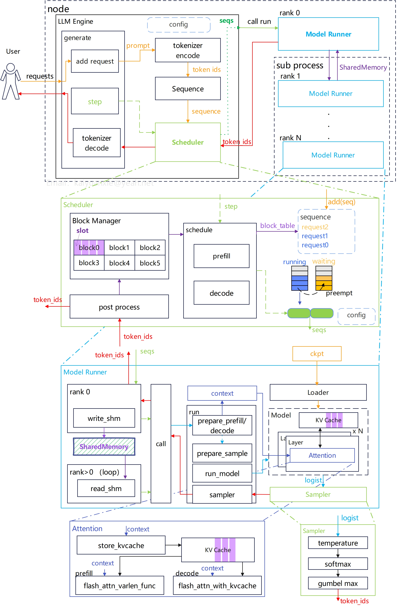
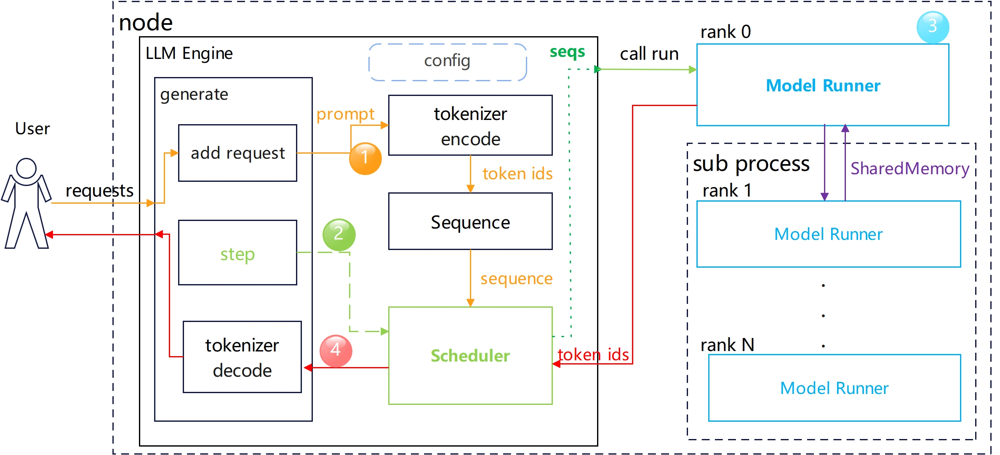
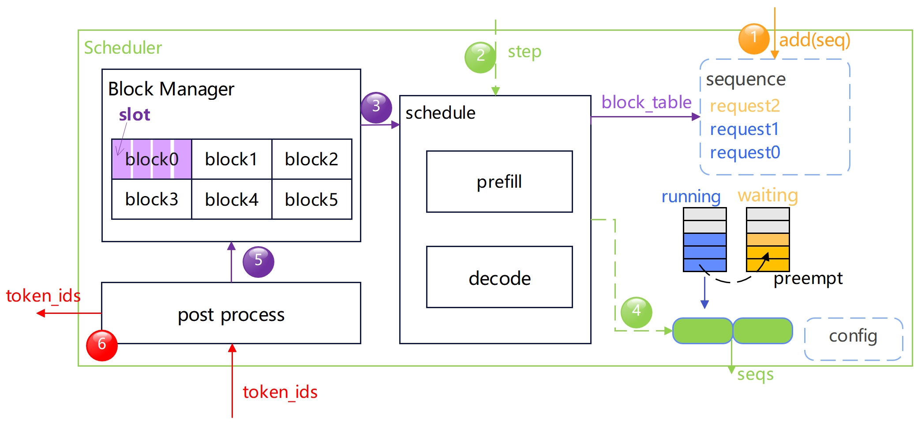
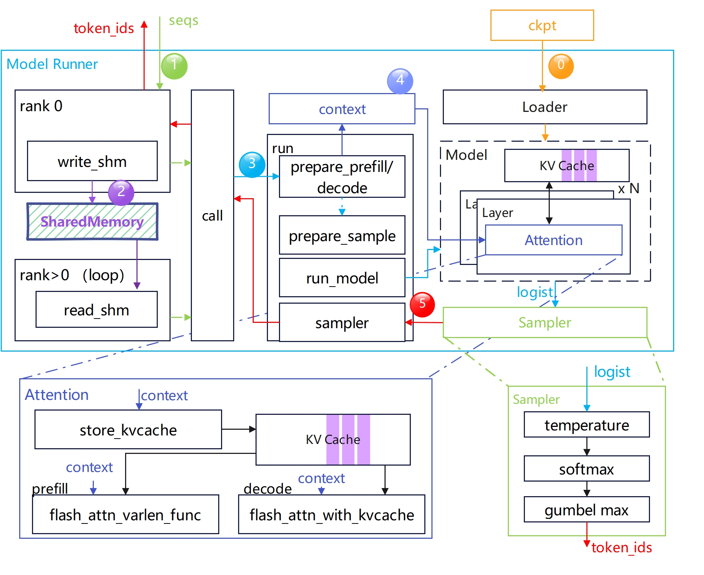

# Structure of Nano-vLLM

Nano-vLLM is a lightweight inference framework that supports running with Tensor Parallelism (TP) within a single node.

## Overall Architecture

**Key Components**

- **LLM Engine**: Creates all the modules required for the inference service, provides the interface (`generate`) to
  handle user requests, and completes the encoding, execution, and decoding of request data.
- **Block Manager**: Manages the GPU memory for KV cache based on the PagedAttention mechanism.
- **Scheduler**: Maintains a queue of pending requests, organizes and dispatches the requests to be executed at each
  step.
- **Model Runner**: Loads and runs the model, performing the computations for each request. When TP > 1, the main
  process launches multiple Model Runner instances that collectively perform the forward computation.

The overall architecture is shown in the figure below:

## Module Introduction

### LLM Engine

The LLM Engine is the core module of the inference framework. It creates a Scheduler instance and at least one Model
Runner instance. Its main logic is encapsulated in the `generate` function, and data is passed between modules via
parameters. The execution steps are as follows (illustrated in conjunction with the diagram below):

1. Upon receiving a user request, the prompt is encoded into token IDs using a tokenizer, and a `Sequence` instance is
   created for each request.
2. The `step` function is called to trigger scheduler execution. The scheduler passes the request data to be executed to
   the Model Runner. If there are multiple Model Runners, the data is only transmitted to the Model Runner at rank 0.
3. The Model Runner performs the forward computation of the model and obtains the generated token IDs.
4. The token IDs are decoded into a string and returned to the user, while the scheduler releases the corresponding
   resources.

### Scheduler

The scheduler is responsible for dispatching requests and organizing their execution. It maintains two queues
internally: the `running` queue and the `waiting` queue. Multiple requests rotate between these two queues. The
scheduling logic adopts a prefill-first strategy by default: when a new prefill request arrives, it can interrupt the
ongoing decode execution, and the interrupted request is moved to the `waiting` queue. The preemption logic is: when
resources for request execution are insufficient, requests that entered the `running` queue later are transferred to the
`waiting` queue according to their entry order.

The scheduler internally creates a Block Manager instance, which is used to allocate KV cache blocks for requests. Its
main execution steps are as follows (illustrated in conjunction with the diagram below):

1. After receiving a new request, it is added to the waiting queue.
2. Execute `step`, which consists of two phases: prefill and decode.
3. Allocate blocks for the requests to be executed, with information recorded in the block table.
4. Package the array `seqs` of requests that need to be executed at the current step.
5. After forward computation, perform post-processing to release the KV cache resources occupied by completed requests.
6. Return the `token ids` to the tokenizer for decoding.

### Model Runner

The Model Runner primarily performs the forward computation of the model. When TP > 1, `multiprocessing` is used to
manage cooperation among different ranks. The Model Runner created at rank 0 receives the `seqs` data and shares it with
other processes via `SharedMemory`; only rank 0 returns the computation results. The key function of the Model Runner is
`run`. The execution steps are as follows (illustrated in conjunction with the diagram below):

0. When the inference service starts, it must load the model parameters, create the KV cache, and perform warm-up.
1. Rank 0 receives the pending requests from the scheduler.
2. Rank 0 writes the request data into `SharedMemory`. Other ranks continuously read from `SharedMemory` by calling the
   `loop` function; upon reading the request data `seqs`, they start execution.
3. The Model Runner performs the `run` operation, which includes data preparation, model execution, and logits sampling.
4. During the preparation phase, `context` data is created. This data is primarily used in the attention stage,
   providing input parameters for the flash attention operators.
5. The `logits` obtained from the model forward computation are sampled by the sampler, and after sampling, `token ids`
   are returned.

In the attention stage, the KV cache is written into the KV cache tensor via the `store_kvcache` function. The attention
computation invokes different FA operators depending on whether it is currently in the prefill or decode phase. The
current sampling computation process includes temperature, softmax, and gumbel max calculations.

## Code Introduction

### Main External Modules Used in Code Implementation

- Uses PyTorch to implement model layers and `torch.distributed` for distributed computation;
- Uses `flash_attn` to build the attention module, and the `AutoTokenizer` from `transformers` for encoding and
  decoding;
- Uses `SharedMemory` from `multiprocessing` for data coordination and `Event` for synchronization among ranks;
- Uses the `triton` library to customize the KV cache storage function for fast KV cache writes;
- Uses `safe_open` from the `safetensors` library to build the model parameter loading function.

### Code Organization

- `nanovllm.engine`: Contains the definitions of key framework modules, including `Sequence`, `Scheduler`,
  `ModelRunner`, `BlockManager`, etc.
- `nanovllm.layers`: Implements model layers, such as `activation`, `attention`, `linear`, `embedding`, `sampler`, etc.
- `nanovllm.models`: Contains the implementations of specific model architectures; currently only supports the Qwen3
  model.
- `nanovllm.sampling_params`: Defines `SamplingParams` to store sampling parameters.
- `nanovllm.config`: Defines basic framework runtime parameters, such as `max_num_batched_tokens`, `max_num_seqs`,
  `gpu_memory_utilization`, etc.
- `nanovllm.utils`: Implements `Context` and `load_model`. Only one `Context` instance is instantiated per process.